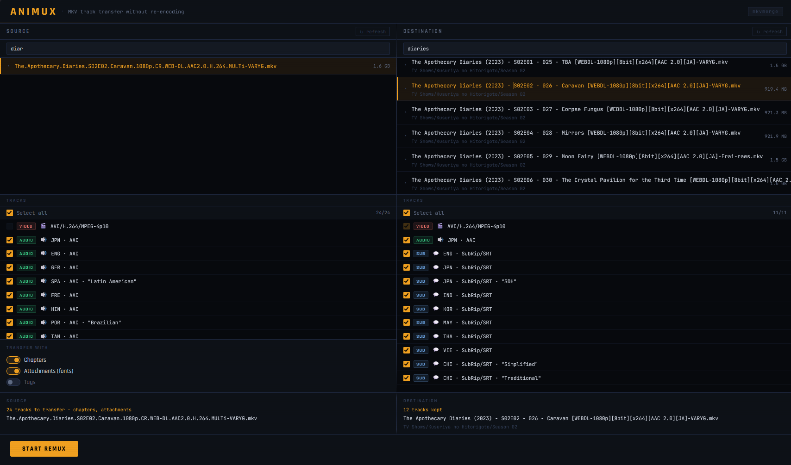

# AniMux

A web-based MKV remuxing tool. Select a source and destination file, pick which tracks to keep and which to transfer, and AniMux calls `mkvmerge` to update the destination in-place — no re-encoding, ever.

---



## Installation

### Docker (recommended)

Pull the published image and run it. Replace the volume paths first:

```bash
docker run -d \
  --name animux \
  --restart unless-stopped \
  -p 8000:8000 \
  -v /path/to/your/source:/source:ro \
  -v /path/to/your/destination:/destination:rw \
  -e SOURCE_DIR=/source \
  -e DEST_DIR=/destination \
  ghcr.io/otakuforlife/animux:latest
```

| Flag | Purpose |
|---|---|
| `-p 8000:8000` | Host port → container port (change the first `8000` if needed) |
| `-v …:/source:ro` | Folder with source MKV files (read-only) |
| `-v …:/destination:rw` | Folder with destination MKV files (read/write) |
| `SOURCE_DIR` / `DEST_DIR` | Mount paths inside the container (defaults match the `-v` targets above) |

Open **http://localhost:8000** (or your chosen host port). The app always listens on port `8000` inside the container.

### Docker Compose (from source)

For local development or running a build from a cloned repo. Compose uses `build: .` — it does **not** pull the GHCR image.

```bash
git clone https://github.com/OtakuForLife/AniMux.git
cd AniMux
```

Edit `docker-compose.yml` and replace the volume paths:

```yaml
volumes:
  - /path/to/your/source:/source:ro
  - /path/to/your/destination:/destination:rw
```

Then start the container:

```bash
docker compose up --build -d
```

Open **http://localhost:8000** in your browser.

### Unraid

1. In the Unraid Docker UI, click **Add Container**.
2. Set **Repository** to `ghcr.io/otakuforlife/animux:latest`
3. **Network Type:** Bridge
4. **Add Port** — container port `8000`, host port whatever you prefer (e.g. `8000`)
5. **Add Path** (read-only, source MKV files):
   - Container: `/source`
   - Host: e.g. `/mnt/user/downloads`
6. **Add Path** (read/write, destination MKV files):
   - Container: `/destination`
   - Host: e.g. `/mnt/user/media`
7. Click **Apply**.

Open **http://[unraid-ip]:[host-port]**.

**Optional:** Install the template for one-click setup next time:

```bash
wget -O /boot/config/plugins/dockerMan/templates-user/animux.xml \
  https://raw.githubusercontent.com/OtakuForLife/AniMux/main/unraid-template.xml
```

After that, **AniMux** appears in the template dropdown when adding a container.

---

## How It Works

1. **Source** — browse and select the MKV you want to copy tracks *from*.
2. **Destination** — browse and select the MKV you want to update.
3. **Pick destination tracks** — choose which existing audio/subtitle tracks to keep (video is always kept).
4. **Pick source tracks** — choose which audio/subtitle tracks to add, plus optional chapters, attachments (fonts), and tags.
5. **Start** — AniMux runs `mkvmerge` in the background; a progress bar and live log show the status.
6. On success the destination file is atomically replaced (written to a temp file first, then swapped in — no half-written files).

---

## Supported Transfers

| Type | Notes |
|---|---|
| Audio tracks | Any codec; preserves language and title metadata |
| Subtitle tracks | SRT, ASS, PGS, and any other mkvmerge-supported format |
| Chapters | Named and ordered chapter entries |
| Attachments | Fonts and any other embedded files |
| Tags | Global and track-level tag blocks |

Video from the **destination** file is always kept. Source video is never copied — only selected audio, subtitles, and optional metadata are merged in.
